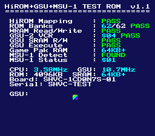
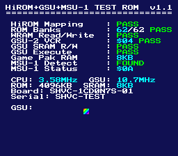

# SNES HiROM+GSU+MSU-1 Test ROM

A standalone **4 MB** test ROM for validating **HiROM + SuperFX (GSU-2) + MSU-1** coprocessor configurations in SNES emulators and flash cartridges.

No commercial SNES cartridge ever combined HiROM with SuperFX — all retail SuperFX games used LoROM. This ROM exists because homebrew projects targeting modern flash cartridges (FXPak Pro) can benefit from HiROM's 64KB contiguous banks alongside the GSU-2 coprocessor.

## Screenshots

| Mesen 2 | bsnes v115 |
|---------|------------|
|  |  |

9 hardware tests with color-coded results (green=PASS, red=FAIL, yellow=SKIP, cyan=info). The rainbow sprite at bottom-left is rendered by the GSU-2 — 15 colors written to Game Pak RAM by the SuperFX, DMA'd to VRAM, displayed via OAM.

## Tests

| Test | Verifies | Pass Condition |
|------|----------|----------------|
| **HiROM Mapping** | RESET vector readable from `$C0:FFFC` and `$00:FFFC` | Values match |
| **ROM Banks** | Unique signature at `$FFA0` in each of 62 ROM banks (`$C0`-`$EF`, `$F2`-`$FF`) | All 62 match |
| **WRAM Read/Write** | Write `$A55A` to `$7E:2000`, read back | Read == Write |
| **GSU-2 VCR** | Version Code Register at `$303B` | VCR == `$04` |
| **GSU SRAM R/W** | Write/read patterns to `$70:0000`-`$70:0003` | Read == Write |
| **GSU Execute** | Copy pixel_test to `$70:0100`, trigger via R15, poll SFR.GO | GSU halts via STOP |
| **Game Pak RAM** | Probe power-of-2 boundaries for address wraparound | Reports detected size |
| **MSU-1 Detect** | Read `$002002`-`$002007`, compare to `S-MSU1` | ID matches |
| **MSU-1 Status** | Read `MSU_STATUS` (`$2000`) | Informational |

Banks `$F0`-`$F1` are skipped (SRAM mirrors). The companion `.msu` file enables MSU-1 detection in emulators.

## ROM Configuration

| Field | Value |
|-------|-------|
| Size | 4 MB (64 banks x 64 KB) |
| Mapping | HiROM + FastROM (`$31`) |
| Cart Type | ROM + GSU + RAM + Battery (`$15`) |
| SRAM | 8 KB at `$70`-`$71` |

## Running

### Emulators

**Mesen 2** (with [HiROM+GSU patch](https://github.com/SourMesen/Mesen2/pull/89)): Load `HiRomGsuTest.sfc` directly. Place `HiRomGsuTest.msu` alongside for MSU-1 detection.

**bsnes**: Place `hirom_gsu_test.bml` alongside the ROM.

### Hardware (FXPak Pro)

Stock FXPak Pro firmware (v1.11.0) does **not** enable the SuperFX FPGA core for HiROM ROMs. A [one-line firmware patch](https://github.com/mrehkopf/sd2snes/pull/289) adds support. Without it, GSU tests show FAIL/SKIPPED but all other tests (HiROM mapping, bank verification, MSU-1) work correctly.

### Expected Results

| Platform | HiROM | Banks | GSU VCR | GSU Exec | MSU-1 |
|----------|-------|-------|---------|----------|-------|
| Mesen 2 (patched) | PASS | 62/62 | $04 PASS | PASS | FOUND |
| bsnes (with .bml) | PASS | 62/62 | $04 PASS | PASS | FOUND |
| FXPak Pro (stock) | PASS | 62/62 | $00 FAIL | SKIP | FOUND |
| FXPak Pro (patched) | PASS | 62/62 | $04 PASS | PASS | FOUND |

## Building

See [BUILD.md](BUILD.md) for full instructions.

Quick start (WSL or Linux):
```bash
make        # -> build/HiRomGsuTest.sfc + build/HiRomGsuTest.msu
```

## Related PRs

- **Mesen2**: [HiROM+GSU support](https://github.com/SourMesen/Mesen2/pull/89)
- **bsnes**: [HiROM+GSU board recognition](https://github.com/bsnes-emu/bsnes/pull/380)
- **FXPak Pro**: [SuperFX FPGA core for HiROM](https://github.com/mrehkopf/sd2snes/pull/289)

## License

Public domain. Use freely for emulator testing, development, and validation.
